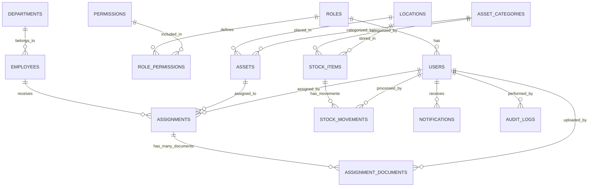
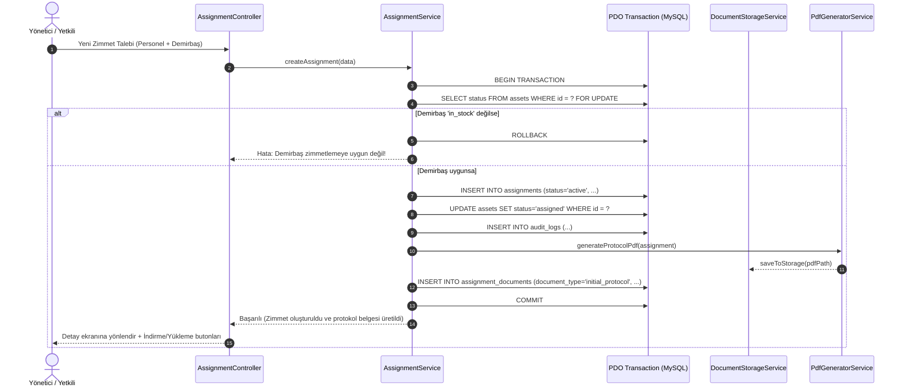

# DEMİRBAŞ VE ZİMMET YÖNETİM SİSTEMİ
## TEKNİK MİMARİ VE SİSTEM ANALİZİ DOKÜMANI (AŞAMA 1)

**Sürüm:** 1.0.0  
**Tarih:** 2026-09-27  
**Geliştirici Rolü:** Full Stack PHP Developer, Database Architect & UI/UX Designer  
**Hedef Ortam:** PHP 8.2+, MySQL 8.0+ / MariaDB 10.5+, Apache/Nginx  

---

### 1. GENEL BAKIŞ VE PROJE AMACI
Bu sistem; bir kurum veya işletmenin tüm demirbaşlarını (IT donanımları, ofis mobilyaları, araçlar, sarf stokları), personel envanterini, departman/lokasyon ilişkilerini ve demirbaş-personel arasındaki zimmet döngüsünü (teslim, iade, arıza, servis, hurda) uçtan uca yönetmek üzere tasarlanmış kurumsal seviyede bir web uygulamasıdır.

Sistemin en kritik bileşenleri:
- **Zimmet - Demirbaş - Stok Döngüsü:** Veritabanı transaction güvencesiyle senkronize durum yönetimi.
- **Güvenli Zimmet Belge Sistemi:** Web root dışında tutulan, MIME ve magic bytes denetimli, yetki kontrollü indirilebilen çoklu belge yönetimi.
- **Otomatik Zimmet Protokolü (PDF):** İki taraflı ıslak/dijital imza alanlarına sahip kurumsal teslim tutanağı üretimi.
- **İşlem Geçmişi (Audit Log) & Bildirim Motoru:** Kritik stok, geciken iadeler ve sistem aksiyonlarının izlenmesi.

---

### 2. YAZILIM VE TEKNOLOJİ MİMARİSİ

#### 2.1 Backend Mimarisi
- **Çekirdek:** PHP 8.2+ (Strict types, Typed properties, Match expressions, Constructor promotion).
- **Veritabanı Katmanı:** PHP Data Objects (PDO) - 100% Prepared Statements, Parametre bağlama (binding), UTF8MB4 desteği, Transaction yönetimi.
- **Mimari Desen:** Model-View-Controller (MVC) + Servis Katmanı (Service Layer) + Repository/Model abstraction.
- **Giriş Noktası (Front Controller):** `public/index.php`. Tüm HTTP istekleri rewrite motoru (.htaccess / Nginx) üzerinden buraya yönlendirilir.
- **Autoloading:** PSR-4 standardında namespace tabanlı otomatik yükleme (`App\` namespace).
- **Yönlendirme (Routing):** HTTP Metotları (GET, POST, PUT, DELETE), regex parametre yakalama, grup yönlendirmeleri ve middleware zinciri (Pipeline pattern).
- **Harici Kütüphaneler (Composer ile entegre edilecek):**
  - `dompdf/dompdf` veya `tecnickcom/tcpdf`: Otomatik zimmet tutanağı ve rapor PDF çıktıları.
  - `phpoffice/phpspreadsheet`: Excel içe/dışa aktarma işlemleri.
  - `phpmailer/phpmailer`: E-posta ve gecikme uyarı bildirimleri.

#### 2.2 Frontend & UI/UX Mimarisi
- **Arayüz Temeli:** Modern HTML5, Responsive CSS Grid/Flexbox, Tailwind CSS / Bootstrap 5 bileşenleri.
- **Tasarım Dili & Renk Paleti:**
  - Modern kurumsal tema (Dark/Light uyumlu, Slate & Deep Indigo tabanlı).
  - Durum Renkleri:
    - *Stokta / Aktif / İade Edildi:* `#10B981` (Emerald Yeşil)
    - *Zimmetli / Kullanımda:* `#3B82F6` (Mavi)
    - *İade Bekliyor / Serviste:* `#F59E0B` (Amber Sarı)
    - *Arızalı / Kayıp / Hurda:* `#EF4444` (Kırmızı)
- **Dinamizm:** Vanilla JS + Modern Fetch API / AJAX; sayfa yenilemeden modal üzerinden hızlı zimmetleme, anlık arama (debounce), tablo filtreleme ve belge yükleme.

---

### 3. PROJE DİZİN VE KLASÖR YAPISI

Sistem güvenlik gereği "Public Document Root" izolasyonuna göre dizayn edilmiştir:

```text
/demirbas/
├── app/
│   ├── Core/                         # Çekirdek MVC motoru
│   │   ├── Application.php           # Uygulama yaşam döngüsü yöneticisi
│   │   ├── Router.php                # URL route eşleştirici ve middleware yürütücü
│   │   ├── Request.php               # HTTP İstek soyutlaması (GET, POST, FILES, Headers)
│   │   ├── Response.php              # HTTP Yanıt (HTML, JSON, File Stream, Redirect)
│   │   ├── Controller.php            # Temel Controller sınıfı (render, json, validate)
│   │   ├── Model.php                 # PDO tabanlı temel Model sınıfı (CRUD, Query Builder)
│   │   ├── View.php                  # Şablon motoru ve render bileşeni
│   │   ├── Database.php              # Singleton PDO bağlantı yöneticisi
│   │   └── Container.php             # Servis konteyneri ve bağımlılık çözücü
│   │
│   ├── Controllers/                  # Uygulama denetleyicileri
│   │   ├── AuthController.php        # Giriş, çıkış, şifre sıfırlama
│   │   ├── DashboardController.php   # İstatistikler, son işlemler, özet kartları
│   │   ├── AssetController.php       # Demirbaş CRUD, barkod, filtreleme
│   │   ├── EmployeeController.php    # Personel CRUD, detay ve zimmet geçmişi
│   │   ├── AssignmentController.php  # Zimmet verme, iade alma, teslim tutanağı
│   │   ├── DocumentController.php    # Güvenli belge yükleme, indirme, görüntüleme
│   │   ├── StockController.php       # Stok kartları, hareketler, kritik stok
│   │   ├── ReportController.php      # Raporlama, filtreleme, PDF/Excel export
│   │   ├── NotificationController.php# Sistem bildirimleri
│   │   ├── AuditLogController.php    # İşlem geçmişi denetim kayıtları
│   │   ├── UserController.php        # Kullanıcı yönetimi
│   │   └── SettingController.php     # Sistem ayarları, kurum bilgileri
│   │
│   ├── Models/                       # Veritabanı modelleri
│   │   ├── User.php
│   │   ├── Role.php
│   │   ├── Permission.php
│   │   ├── Department.php
│   │   ├── Location.php
│   │   ├── Employee.php
│   │   ├── AssetCategory.php
│   │   ├── Asset.php
│   │   ├── Assignment.php
│   │   ├── AssignmentDocument.php
│   │   ├── StockItem.php
│   │   ├── StockMovement.php
│   │   ├── Notification.php
│   │   ├── AuditLog.php
│   │   └── Setting.php
│   │
│   ├── Services/                     # İş mantığı (Business Logic) katmanı
│   │   ├── AuthService.php           # Kimlik doğrulama, token, oturum kontrolü
│   │   ├── AssignmentService.php     # Zimmet atama, iade, transaction ve durum senkronu
│   │   ├── DocumentStorageService.php# Dosya yükleme güvenliği, MIME doğrulama, hash
│   │   ├── PdfGeneratorService.php   # Otomatik zimmet protokolü PDF oluşturma
│   │   ├── StockService.php          # Stok hareket hesapları, kritik stok alarmı
│   │   ├── AuditService.php          # Otomatik loglama servisi
│   │   └── NotificationService.php   # Bildirim oluşturma ve dağıtım servisi
│   │
│   ├── Middleware/                   # Ara katman yazılımları
│   │   ├── AuthMiddleware.php        # Oturum kontrolü
│   │   ├── GuestMiddleware.php       # Ziyaretçi kontrolü (login sayfasına erişim)
│   │   ├── RoleMiddleware.php        # Rol bazlı yetkilendirme (Admin, Manager, User)
│   │   ├── PermissionMiddleware.php  # Granüler yetki kontrolü
│   │   ├── CsrfMiddleware.php        # CSRF token doğrulama
│   │   └── RateLimitMiddleware.php   # Brute-force saldırı önleme
│   │
│   ├── Helpers/                      # Yardımcı fonksiyonlar
│   │   ├── CsrfHelper.php            # CSRF token üretme ve denetleme
│   │   ├── SessionHelper.php         # Güvenli session yönetimi ve flash mesajlar
│   │   ├── SecurityHelper.php        # XSS filtreleme, sanitizer, güvenli hash
│   │   ├── FileHelper.php            # Dosya boyut/uzantı/MIME formatlayıcılar
│   │   └── DateHelper.php            # Türkçe tarih formatlama
│   │
│   └── Views/                        # Arayüz şablonları
│       ├── layouts/                  # Ana şablonlar (header, sidebar, footer)
│       │   ├── main.php
│       │   └── auth.php
│       ├── partials/                 # Yeniden kullanılabilir parçalar
│       │   ├── navbar.php
│       │   ├── sidebar.php
│       │   ├── alerts.php
│       │   └── pagination.php
│       ├── auth/                     # Giriş sayfaları
│       ├── dashboard/                # İstatistik ve özet ekranları
│       ├── assets/                   # Demirbaş sayfaları
│       ├── employees/                # Personel sayfaları
│       ├── assignments/              # Zimmet sayfaları ve belge yükleme
│       ├── stock/                    # Stok sayfaları
│       ├── documents/                # Belge önizleme arayüzü
│       ├── reports/                  # Raporlama ekranları
│       ├── audit/                    # İşlem geçmişi tablosu
│       ├── users/                    # Kullanıcı yönetimi
│       └── settings/                 # Ayarlar
│
├── config/                           # Yapılandırma dosyaları
│   ├── app.php                       # Uygulama adı, saat dilimi, dil, debug modu
│   ├── database.php                  # Veritabanı bağlantı ayarları
│   ├── mail.php                      # SMTP ayarları
│   ├── storage.php                   # Dosya boyut limitleri, izin verilen MIME'lar
│   └── permissions.php               # Rol ve yetki matrisi tanımları
│
├── database/                         # Veritabanı göç ve tohumlama dosyaları
│   ├── schema.sql                    # Tüm tablolar ve ilişkiler (DDL)
│   └── seeders.sql                   # Varsayılan roller, yetkiler, admin kullanıcısı
│
├── public/                           # Web sunucusunun işaret edeceği tek kök dizin
│   ├── index.php                     # Uygulama giriş kapısı (Front Controller)
│   ├── .htaccess                     # Apache mod_rewrite yönlendirme kuralları
│   └── assets/                       # Statik kaynaklar
│       ├── css/                      # Özel ve derlenmiş stiller
│       ├── js/                       # Uygulama scriptleri ve AJAX kütüphaneleri
│       ├── images/                   # Kurum logosu, varsayılan avatarlar
│       └── vendors/                  # Harici kütüphaneler (Bootstrap/FontAwesome vb.)
│
├── storage/                          # Web kök dizini DIŞINDAKI güvenli depolama alanı
│   ├── uploads/                      # Yüklenen dosyalar (Doğrudan URL erişimine KAPALI)
│   │   ├── assignments/              # Zimmet belgeleri (PDF, JPG, PNG)
│   │   ├── employees/                # Personel fotoğrafları
│   │   └── assets/                   # Demirbaş fotoğrafları
│   ├── generated_docs/               # Sistem tarafından üretilen PDF zimmet tutanakları
│   └── logs/                         # Hata ve sistem logları (app.log, audit.log)
│
├── routes/
│   ├── web.php                       # Web arayüz route tanımları
│   └── api.php                       # AJAX / REST endpoint tanımları
│
├── composer.json                     # PSR-4 autoload ve bağımlılık yöneticisi
├── .env.example                      # Ortam değişkenleri şablonu
└── .gitignore                        # Git dışlama kuralları
```

---

### 4. VERİTABANI MİMARİSİ VE TABLO İLİŞKİLERİ (SCHEMA & ERD)

Veritabanı Motoru: **InnoDB**  
Karakter Seti: **utf8mb4**  
Karşılaştırma (Collation): **utf8mb4_unicode_ci**  



#### 4.1 Tablo Detayları ve Şeması

1. **`roles`**: Sistem rolleri
   - `id` (INT, PK, AI)
   - `name` (VARCHAR(50)) - *Örn: "Yönetici", "Birim Sorumlusu", "Personel"*
   - `slug` (VARCHAR(50), UNIQUE) - *Örn: "admin", "manager", "user"*
   - `description` (TEXT, NULL)
   - `created_at`, `updated_at` (DATETIME)

2. **`permissions`**: Granüler yetkiler
   - `id` (INT, PK, AI)
   - `name` (VARCHAR(100)) - *Örn: "Demirbaş Ekle", "Zimmet İade Al"*
   - `slug` (VARCHAR(100), UNIQUE) - *Örn: "asset.create", "assignment.return"*
   - `module` (VARCHAR(50)) - *Örn: "assets", "assignments", "stock"*
   - `created_at` (DATETIME)

3. **`role_permissions`**: Rol-Yetki eşleştirme
   - `role_id` (INT, FK -> roles.id, ON DELETE CASCADE)
   - `permission_id` (INT, FK -> permissions.id, ON DELETE CASCADE)
   - PRIMARY KEY (`role_id`, `permission_id`)

4. **`users`**: Sistem kullanıcıları
   - `id` (INT, PK, AI)
   - `role_id` (INT, FK -> roles.id)
   - `employee_id` (INT, NULL, FK -> employees.id) - *Personel ile kullanıcı hesabı bağlama*
   - `username` (VARCHAR(50), UNIQUE)
   - `email` (VARCHAR(100), UNIQUE)
   - `password_hash` (VARCHAR(255))
   - `full_name` (VARCHAR(100))
   - `status` (ENUM('active', 'passive'), DEFAULT 'active')
   - `last_login_at` (DATETIME, NULL)
   - `remember_token` (VARCHAR(100), NULL)
   - `created_at`, `updated_at` (DATETIME)

5. **`departments`**: Kurum departmanları
   - `id` (INT, PK, AI)
   - `name` (VARCHAR(100)) - *Örn: "Bilgi İşlem", "İnsan Kaynakları", "Muhasebe"*
   - `code` (VARCHAR(20), UNIQUE) - *Örn: "DEP-IT", "DEP-IK"*
   - `description` (TEXT, NULL)
   - `status` (ENUM('active', 'passive'), DEFAULT 'active')
   - `created_at`, `updated_at` (DATETIME)

6. **`locations`**: Fiziksel lokasyonlar
   - `id` (INT, PK, AI)
   - `name` (VARCHAR(100)) - *Örn: "Genel Merkez Kat 2", "Depo B Blok"*
   - `code` (VARCHAR(20), UNIQUE)
   - `building` (VARCHAR(100), NULL)
   - `room_number` (VARCHAR(50), NULL)
   - `created_at`, `updated_at` (DATETIME)

7. **`employees`**: Personel kayıtları
   - `id` (INT, PK, AI)
   - `department_id` (INT, FK -> departments.id)
   - `registration_no` (VARCHAR(50), UNIQUE) - *Sicil No*
   - `first_name` (VARCHAR(50))
   - `last_name` (VARCHAR(50))
   - `email` (VARCHAR(100), NULL)
   - `phone` (VARCHAR(30), NULL)
   - `title` (VARCHAR(100)) - *Görev / Ünvan*
   - `hire_date` (DATE, NULL)
   - `status` (ENUM('active', 'passive'), DEFAULT 'active')
   - `photo_path` (VARCHAR(255), NULL)
   - `notes` (TEXT, NULL)
   - `created_at`, `updated_at` (DATETIME)

8. **`asset_categories`**: Demirbaş kategorileri
   - `id` (INT, PK, AI)
   - `parent_id` (INT, NULL, FK -> asset_categories.id)
   - `name` (VARCHAR(100)) - *Örn: "Bilgisayar", "Monitör", "Ofis Mobilyası"*
   - `code` (VARCHAR(20), UNIQUE)
   - `created_at`, `updated_at` (DATETIME)

9. **`assets`**: Demirbaşlar
   - `id` (INT, PK, AI)
   - `category_id` (INT, FK -> asset_categories.id)
   - `location_id` (INT, NULL, FK -> locations.id)
   - `asset_code` (VARCHAR(50), UNIQUE) - *Kurumsal Demirbaş Kodu*
   - `name` (VARCHAR(150)) - *Ürün Tanımı*
   - `brand` (VARCHAR(100)) - *Marka*
   - `model` (VARCHAR(100)) - *Model*
   - `serial_number` (VARCHAR(100), NULL) - *Seri No*
   - `barcode` (VARCHAR(100), NULL) - *Barkod No*
   - `purchase_date` (DATE, NULL)
   - `purchase_price` (DECIMAL(12,2), DEFAULT 0.00)
   - `currency` (VARCHAR(3), DEFAULT 'TRY')
   - `warranty_start` (DATE, NULL)
   - `warranty_end` (DATE, NULL)
   - `status` (ENUM('in_stock', 'assigned', 'in_use', 'defective', 'in_service', 'scrapped', 'lost'), DEFAULT 'in_stock')
   - `photo_path` (VARCHAR(255), NULL)
   - `description` (TEXT, NULL)
   - `created_by` (INT, FK -> users.id)
   - `created_at`, `updated_at` (DATETIME)

10. **`assignments`**: Zimmet işlemleri
    - `id` (INT, PK, AI)
    - `assignment_code` (VARCHAR(50), UNIQUE) - *Örn: ZMT-2026-0001*
    - `employee_id` (INT, FK -> employees.id)
    - `asset_id` (INT, FK -> assets.id)
    - `assigned_by_user_id` (INT, FK -> users.id) - *Teslim Eden Sistem Kullanıcısı*
    - `received_by_name` (VARCHAR(100), NULL) - *Fiziki Teslim Alan (Varsayılan Personel Adı)*
    - `assignment_date` (DATE) - *Zimmet Tarihi*
    - `planned_return_date` (DATE, NULL) - *Planlanan İade Tarihi*
    - `actual_return_date` (DATE, NULL) - *Gerçekleşen İade Tarihi*
    - `status` (ENUM('active', 'returned', 'pending_return', 'lost', 'damaged'), DEFAULT 'active')
    - `return_condition` (ENUM('good', 'damaged', 'defective', 'scrapped'), NULL)
    - `return_notes` (TEXT, NULL)
    - `notes` (TEXT, NULL)
    - `created_at`, `updated_at` (DATETIME)

11. **`assignment_documents`**: Zimmet belgeleri (Çoklu Belge Desteği)
    - `id` (INT, PK, AI)
    - `assignment_id` (INT, FK -> assignments.id, ON DELETE CASCADE)
    - `document_type` (ENUM('initial_protocol', 'return_protocol', 'damage_report', 'service_slip', 'other'), DEFAULT 'initial_protocol')
    - `original_filename` (VARCHAR(255)) - *Kullanıcının yüklediği orijinal isim*
    - `stored_filename` (VARCHAR(255), UNIQUE) - *Sunucudaki güvenli benzersiz isim (UUID)*
    - `file_path` (VARCHAR(255)) - *storage/uploads/assignments/... göreceli yolu*
    - `mime_type` (VARCHAR(100)) - *application/pdf, image/jpeg, image/png vb.*
    - `file_size` (INT) - *Byte cinsinden boyut*
    - `sha256_hash` (CHAR(64), NULL) - *Dosya bütünlük ve çakışma kontrolü*
    - `description` (VARCHAR(255), NULL)
    - `uploaded_by_user_id` (INT, FK -> users.id)
    - `uploaded_at` (DATETIME)

12. **`stock_items`**: Sarf / Adetli Stok Kartları
    - `id` (INT, PK, AI)
    - `category_id` (INT, FK -> asset_categories.id)
    - `location_id` (INT, NULL, FK -> locations.id)
    - `stock_code` (VARCHAR(50), UNIQUE)
    - `name` (VARCHAR(150))
    - `brand` (VARCHAR(100), NULL)
    - `model` (VARCHAR(100), NULL)
    - `unit` (ENUM('piece', 'box', 'meter', 'kg', 'set'), DEFAULT 'piece')
    - `current_stock` (INT, DEFAULT 0)
    - `min_stock` (INT, DEFAULT 5) - *Kritik stok eşiği*
    - `max_stock` (INT, DEFAULT 1000)
    - `description` (TEXT, NULL)
    - `created_at`, `updated_at` (DATETIME)

13. **`stock_movements`**: Stok Giriş / Çıkış Hareketleri
    - `id` (INT, PK, AI)
    - `stock_item_id` (INT, FK -> stock_items.id)
    - `user_id` (INT, FK -> users.id)
    - `movement_type` (ENUM('in', 'out', 'adjustment', 'return', 'assignment_out'))
    - `quantity` (INT)
    - `previous_stock` (INT)
    - `new_stock` (INT)
    - `reference_type` (VARCHAR(50), NULL) - *Örn: 'assignment', 'purchase', 'inventory_check'*
    - `reference_id` (INT, NULL)
    - `notes` (TEXT, NULL)
    - `created_at` (DATETIME)

14. **`notifications`**: Sistem Bildirimleri
    - `id` (INT, PK, AI)
    - `user_id` (INT, NULL, FK -> users.id) - *NULL ise genel yönetici bildirimi*
    - `type` (ENUM('critical_stock', 'assignment_return_due', 'overdue_return', 'new_assignment', 'document_missing', 'system_alert'))
    - `title` (VARCHAR(150))
    - `message` (TEXT)
    - `link` (VARCHAR(255), NULL)
    - `is_read` (TINYINT(1), DEFAULT 0)
    - `read_at` (DATETIME, NULL)
    - `created_at` (DATETIME)

15. **`audit_logs`**: İşlem Geçmişi (Audit Trail)
    - `id` (BIGINT, PK, AI)
    - `user_id` (INT, NULL, FK -> users.id)
    - `action` (VARCHAR(50)) - *Örn: 'asset.create', 'assignment.create', 'document.delete'*
    - `module` (VARCHAR(50)) - *Örn: 'assets', 'assignments', 'documents', 'auth'*
    - `record_id` (INT, NULL)
    - `ip_address` (VARCHAR(45))
    - `user_agent` (VARCHAR(255), NULL)
    - `old_values` (JSON, NULL)
    - `new_values` (JSON, NULL)
    - `created_at` (DATETIME)

16. **`settings`**: Dinamik Sistem ve Kurum Ayarları
    - `id` (INT, PK, AI)
    - `key` (VARCHAR(50), UNIQUE) - *Örn: 'company_name', 'company_logo', 'critical_stock_alert_email'*
    - `value` (TEXT, NULL)
    - `group` (VARCHAR(30), DEFAULT 'general') - *'general', 'company', 'mail', 'assignment'*
    - `description` (VARCHAR(255), NULL)
    - `updated_at` (DATETIME)

---

### 5. ZİMMET İŞ AKIŞI VE VERİTABANI TRANSACTION MANTIĞI

Zimmet verme ve iade alma işlemleri kritik iş mantığı içerir. Sistem bu işlemleri **ACID** ilkelerine uygun olarak PDO Transaction bloğu içinde yürütür:



İade senaryosunda:
1. `BEGIN TRANSACTION`
2. `assignments` tablosunda `status = 'returned'`, `actual_return_date = NOW()`, `return_condition = ?` güncellenir.
3. Demirbaşın iade durumuna göre `assets` tablosunda durum senkronize edilir:
   - Sağlam iade -> `status = 'in_stock'`
   - Arızalı iade -> `status = 'defective'`
   - Servise gidecek -> `status = 'in_service'`
   - Hurda -> `status = 'scrapped'`
4. Varsa iade tutanağı / hasar belgesi `assignment_documents` tablosuna işlenir.
5. `audit_logs` tablosuna detaylı kayıt düşülür.
6. `COMMIT`

---

### 6. GÜVENLİ DOSYA YÜKLEME VE BELGE ERİŞİM MİMARİSİ

Kurumsal belgeler (kimlik, imza içeren zimmet tutanakları, servis raporları) kesinlikle doğrudan internete açık (`public/`) klasörlerde saklanamaz.

#### 6.1 Dosya Yükleme Güvenlik Protokolü
1. **Dizin İzolasyonu:** Yükleme dizini `/storage/uploads/assignments/` altında, web root dışındadır.
2. **Uzantı Beyaz Listesi (Whitelist):** Sadece `.pdf`, `.jpg`, `.jpeg`, `.png`, `.docx` kabul edilir. `.php`, `.phtml`, `.exe`, `.sh`, `.js` kesin olarak reddedilir.
3. **MIME & Magic Bytes Doğrulaması:** İstemcinin gönderdiği `$_FILES['doc']['type']` bilgisine asla güvenilmez. PHP'nin `finfo_open(FILEINFO_MIME_TYPE)` fonksiyonu ve dosya ilk baytları (magic numbers) okunarak doğrulanır:
   - PDF: `application/pdf` (İlk baytlar: `%PDF-`)
   - JPEG: `image/jpeg` (İlk baytlar: `\xFF\xD8\xFF`)
   - PNG: `image/png` (İlk baytlar: `\x89PNG\r\n\x1a\n`)
4. **Benzersiz Dosya İsmi (Anti-Collision & Path Traversal):**
   - Orijinal dosya adı temizlenir ve yalnızca veritabanında gösterim amacıyla saklanır (`original_filename`).
   - Disk üzerindeki dosya adı: `bin2hex(random_bytes(16)) . '_' . time() . '.' . $extension` formatında üretilir (`stored_filename`).
5. **Boyut Sınırı:** Varsayılan maksimum 10 MB (yapılandırılabilir).

#### 6.2 Yetkili Belge Görüntüleme ve İndirme Akışı (Secure Stream)
Kullanıcı bir belgeyi görüntülemek istediğinde istek doğrudan dosyaya değil, PHP Controller endpoint'ine gider:
`GET /assignments/documents/download/{id}` veya `GET /assignments/documents/preview/{id}`

İşlem adımları:
1. Kullanıcı oturum açmış mı? (Session doğrulaması)
2. Kullanıcının bu zimmet kaydını ve belgeyi görme rolü/yetkisi var mı? (RBAC denetimi)
3. Belge veritabanında ve fiziki diskte mevcut mu?
4. Başarılı ise PHP `readfile()` veya stream buffer ile istemciye aktarılır:
   ```http
   Content-Type: application/pdf (veya image/jpeg)
   Content-Disposition: inline; filename="Ahmet_Yilmaz_Laptop_Zimmet.pdf"
   X-Content-Type-Options: nosniff
   Cache-Control: private, no-transform, no-store
   ```
5. İndirme veya görüntüleme olayı `audit_logs` tablosuna kaydedilir.

---

### 7. KİMLİK DOĞRULAMA VE YETKİLENDİRME (RBAC)

#### 7.1 Rol Tanımları
- **ADMIN:** Tüm sistem fonksiyonlarına tam erişim (Kullanıcı oluşturma, rol yetkileri, sistem ayarları, audit logları, tüm demirbaş ve zimmet operasyonları).
- **MANAGER:** Operasyonel tam yetki (Demirbaş, Personel, Zimmet, Stok, Belge Yükleme, Raporlar ve Bildirimler). Sistem ayarları ve kullanıcı yönetimine erişemez.
- **USER:** Görüntüleme ve talep odaklı kısıtlı yetki (Kendi üzerindeki demirbaşları görme, zimmet listelerini salt-okunur inceleme, belge indirme - yalnızca yetkisi dahilinde).

#### 7.2 Güvenlik Standartları
- **Şifreleme:** `password_hash($password, PASSWORD_ARGON2ID)` veya yüksek maliyetli `PASSWORD_BCRYPT` (Cost 12).
- **Session Hijacking & Fixation Koruması:**
  - Giriş anında `session_regenerate_id(true)`.
  - Cookie bayrakları: `HttpOnly=true`, `SameSite=Strict`, `Secure=auto (HTTPS algılandığında aktif)`.
  - Kullanıcı tarayıcı User-Agent ve IP fingerprint kontrolü.
- **Brute-Force Koruması:** Yanlış giriş denemelerinde IP ve kullanıcı adı bazlı süre kısıtlaması (Rate Limiting).
- **CSRF Koruması:** Her oturum için kriptografik token üretilir; tüm POST/PUT/DELETE formlarında ve AJAX isteklerinde `X-CSRF-TOKEN` başlığıyla doğrulanır.
- **SQL Injection:** Tüm veritabanı sorgularında istisnasız PDO Prepared Statements kullanılır.
- **XSS Koruması:** Kullanıcıdan gelen tüm çıktılar view katmanında `htmlspecialchars($str, ENT_QUOTES, 'UTF-8')` ile escape edilir.

---

### 8. GELİŞTİRME YOL HARİTASI VE ADIMLARI

1. **Aşama 1 (Şu Anki Aşama):** Proje Analizi, Teknik Mimari ve Dokümantasyon Planı.
2. **Aşama 2:** PHP Proje Kurulumu, Core MVC Motoru (Router, Request, Response, Controller, Model, View, DB Singleton), PSR-4 yapısı ve Klasörlerin oluşturulması.
3. **Aşama 3:** MySQL Veritabanı, Tablo DDL scriptleri, İlişkiler, İndeksler ve Başlangıç Tohum Verileri (Seeders).
4. **Aşama 4:** Login / Authentication, Güvenli Session, CSRF Motoru, Yetki Middleware'leri.
5. **Aşama 5:** Dashboard ve Modern Responsive Ana Arayüz (Özet istatistik kartları, son işlemler, grafikler).
6. **Aşama 6:** Personel Modülü (CRUD, Sicil No, Departman filtreleme, personel detayında zimmet geçmişi).
7. **Aşama 7:** Demirbaş Modülü (Kategori, lokasyon, seri no, barkod, durum yönetimi, filtreleme).
8. **Aşama 8:** Zimmet Modülü (Zimmet verme, iade alma, veritabanı transaction, durum senkronizasyonu).
9. **Aşama 9:** Zimmet Belgesi Yükleme Sistemi (MIME & Magic Bytes denetimi, güvenli depolama, çoklu belge desteği, yetkili indirme).
10. **Aşama 10:** Otomatik PDF Zimmet Belgesi Üretimi (Kurum logolu, çift taraflı imza tutanağı).
11. **Aşama 11:** Stok Modülü (Sarf stok kartları, giriş/çıkış hareketleri, kritik stok uyarıları).
12. **Aşama 12:** İşlem Geçmişi / Audit Log (Kullanıcı, işlem, IP, eski/yeni JSON değerleri).
13. **Aşama 13:** Bildirim Sistemi (Kritik stok, yaklaşan iade, geciken zimmet bildirimleri).
14. **Aşama 14:** Raporlama Modülü (Çok kriterli filtreler, analizler).
15. **Aşama 15:** Kullanıcı ve Yetkilendirme Yönetimi (Rol ve izin atama).
16. **Aşama 16:** Sistem Ayarları (Kurum adı, logosu, bildirim tercihleri).
17. **Aşama 17:** Excel ve PDF Dışa Aktarma Motoru.
18. **Aşama 18:** Güvenlik Denetimi ve Penetrasyon İyileştirmeleri.
19. **Aşama 19:** Uçtan Uca Testler ve Hata Düzeltmeleri.
20. **Aşama 20:** Sunucu Dağıtım ve Production Hazırlığı.

---
*Doküman Sonu - Aşama 1 Tamamlandı.*
